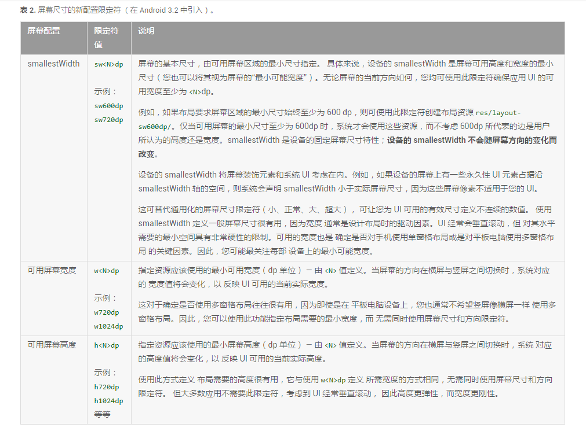
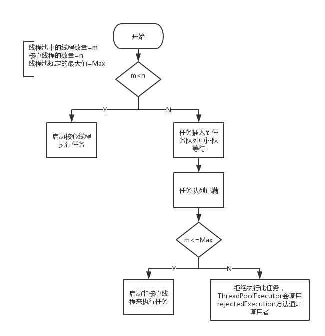

# AndroidDrawable

**使用简单，比自定义View的成本要低**

**非图片类型的Drawable占用空间较小，这对减小apk的大小有帮助**

1. BitmapDrawable

2. ShapeDrawable

3. LayerDrawable

4. StateListDrawable

5. LevelListDrawable

6. TransitionDrawable

7. InsetDrawable
> 不常使用

8. ScaleDrawable
> 不常使用

9. ClipDrawable
> 不常使用

**sw600dp后缀**

**Attr、Style和Theme详解**
- Attr：属性，风格样式的最小单元

- Style：风格，它是一系列Attr的集合用以定义一个View的样式，比如height、width、padding等

- Theme：主题，它与Style作用一样，不同于Style作用于个一个单独View，而它是作用于Activity上或是整个应用

- 自定义View的三个构造函数
<pre>
     第一属于程序内实例化时采用，之传入Context即可
     第二个用于layout文件实例化，会把XML内的参数通过AttributeSet带入到View内。
     第三个主题的style信息，也会从XML里带入
     现在还有第四个参数了…以后可能还会有更多

     一般继承View类，知晓熟悉使用前两个方法即可，后面的都很少用到。
</pre>

**线程池流程图**

# 演示

# TODO

- anim 目录下

- ContentObserver， ContentObserveable

- Android6.0采坑之旅

- Shell 工具类

1. 设置时区 ，ID不同了
2. WIfI从数据库里获取不一样，getWifiList 为空，要等个几秒钟，
3. 也是无聊

- 任务栈，当启动一个系统级别的dialog时候，它存在与什么栈中呢？

- SparceArray怎么用

# 特点

# CHANGELOG
[Attr、Style和Theme详解](http://www.jianshu.com/p/dd79220b47dd)

[inflater 参数问题](http://www.jianshu.com/p/164e3ed1bc9f)

[Android 技巧](https://github.com/AndroidPreView/AndroidNote/blob/master/blog/Android%E5%BC%80%E5%8F%91%E5%BD%95/Android-%E6%8A%80%E5%B7%A7.md)

