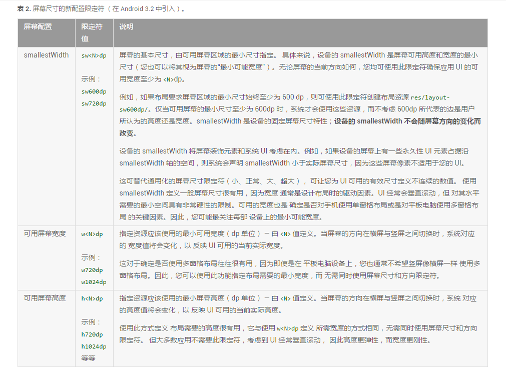

# AndroidDrawable

**使用简单，比自定义View的成本要低**

**非图片类型的Drawable占用空间较小，这对减小apk的大小有帮助**

1. BitmapDrawable

2. ShapeDrawable

3. LayerDrawable

4. StateListDrawable

5. LevelListDrawable

6. TransitionDrawable

7. InsetDrawable
> 不常使用

8. ScaleDrawable
> 不常使用

9. ClipDrawable
> 不常使用

**sw600dp后缀**

**Attr、Style和Theme详解**

# 演示

# TODO

- anim 目录下

# 特点

# CHANGELOG

